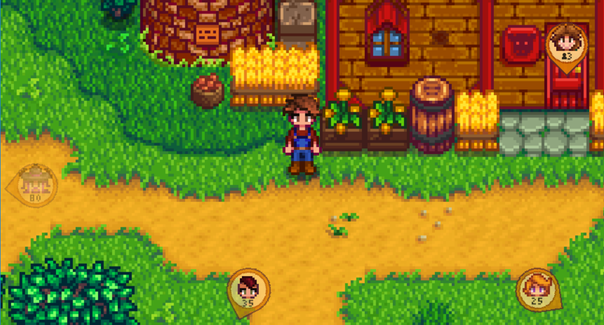

**NPC Location Compass** is a [Stardew Valley](http://stardewvalley.net/) mod which shows floating
icons at the edges of the screen to locate nearby NPCs and players. 

## Install
1. Install the latest version of [SMAPI](https://smapi.io).
2. Install [this mod from Nexus Mods](http://www.nexusmods.com/stardewvalley/mods/3045).
3. Run the game using SMAPI.

## Use
Hold the `ALT` button (configurable) to show the floating icons. If multiple character icons
overlap, you can right-click the icon to scroll through all the icons.

This only shows NPCs and players in your current by default.

## Configure
The mod creates a `config.json` file in its mod folder the first time you run it. You can open that
file in a text editor to configure the mod.

These are the available settings:

setting                 | what it affects
----------------------- | ---------------
`HoldToToggle`          | Whether you need to hold the button to show icons (else the button toggles them). Default `true`.
`SameLocationOnly`      | Whether to only show locations in the current location. If `false`, characters in neighboring locations will be shown in gray. Default `true`.
`ShowQuestsAndBirthdaysOnly` | Whether to only show characters with a quest or birthday today.
`ShowFarmersOnly`       | Whether to only show players. Default `false`.
`ShowHorses`            | Whether to show horses. Default `false`.
`ToggleKeyCode`         | The [key binding](https://stardewvalleywiki.com/Modding:Player_Guide/Key_Bindings) to show/hide the locator icons. Default `"LeftAlt"`.
`SameLocationToggleKey` | The [key binding](https://stardewvalleywiki.com/Modding:Player_Guide/Key_Bindings) to toggle `SameLocationOnly` in-game. Default `"H"`.
`QuestsOnlyToggleKey`   | The [key binding](https://stardewvalleywiki.com/Modding:Player_Guide/Key_Bindings) to toggle `ShowQuestsAndBirthdaysOnly` in-game. Default `"J"`.
`FarmersOnlyToggleKey`  | The [key binding](https://stardewvalleywiki.com/Modding:Player_Guide/Key_Bindings) to toggle `ShowFarmersOnly` in-game. Default `"K"`.
`HorsesToggleKey`       | The [key binding](https://stardewvalleywiki.com/Modding:Player_Guide/Key_Bindings) to toggle `ShowHorses` in-game. Default `"L"`.

## Compatibility
Compatible with Stardew Valley 1.5+ on Linux/macOS/Windows, both single-player and multiplayer.

## See also
* [Release notes](release-notes.md)
