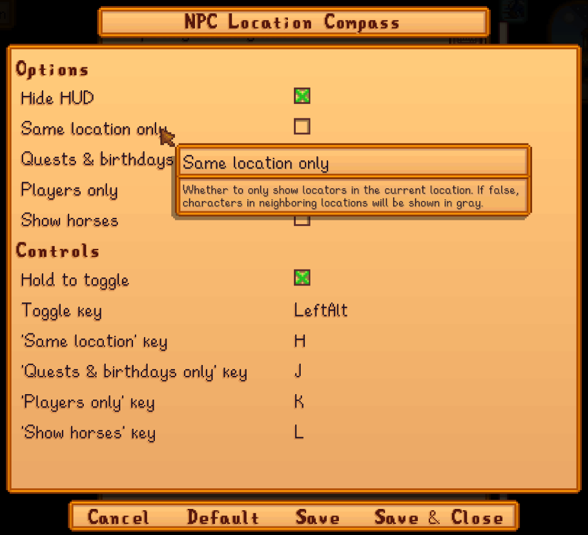

**NPC Location Compass** is a [Stardew Valley](http://stardewvalley.net/) mod which shows floating
icons at the edges of the screen to locate nearby NPCs and players. 

## Install
1. Install the latest version of [SMAPI](https://smapi.io).
2. Install [this mod from Nexus Mods](http://www.nexusmods.com/stardewvalley/mods/3045).
3. Run the game using SMAPI.

## Use
Hold the `ALT` button (configurable) to show the floating icons. If multiple character icons
overlap, you can right-click the icon to scroll through all the icons.

This only shows NPCs and players in your current by default.

## Configure
If you install [Generic Mod Config Menu][], you can click the cog button (⚙) on the title screen
or the "mod options" button at the bottom of the in-game menu to configure the mod. Hover the
cursor over a field for details.

> 

## Compatibility
Compatible with Stardew Valley 1.6.15+ on Linux/macOS/Windows, both single-player and multiplayer.

## See also
* [Release notes](release-notes.md)

[Generic Mod Config Menu]: https://www.nexusmods.com/stardewvalley/mods/5098
