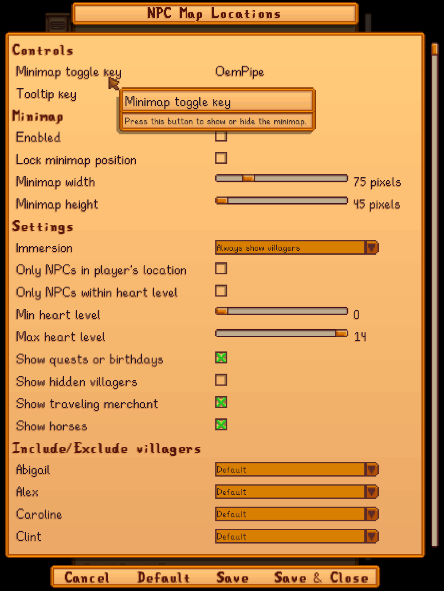

**NPC Map Locations** is a [Stardew Valley](http://stardewvalley.net/) mod which shows the
locations of NPC and farmers on the world map and on a minimap.

## Install
1. Install the latest version of [SMAPI](https://smapi.io).
2. Install [this mod from Nexus Mods](http://www.nexusmods.com/stardewvalley/mods/239).
3. Run the game using SMAPI.

## Use
### For players
Open the in-game map to see the positions for all NPCs, horses, players, and buildings. The map
supports custom locations and NPCs automatically.

While the map is open, press `TAB` (or `Y` on a controller) to show the mod options. You can
show/hide characters automatically based on various criteria (e.g. after they're talked to, when in
same location, within a certain distance, quests and/or birthdays, etc). 

You can optionally enable a minimap. You can move it by holding `CTRL` + right-click on the minimap,
then dragging it to the new position.

### For mod authors
See the [author guide](author-guide.md) for more info.

## Configure
If you install [Generic Mod Config Menu][], you can click the cog button (⚙) on the title screen
or the "mod options" button at the bottom of the in-game menu to configure the mod. Hover the
cursor over a field for details.

> 

## FAQs
* **Why do I see duplicate villagers on the map with UI Info Suite?**  
  UI Info Suite has a feature to show villagers, so having it installed alongside this mod will
  show duplicate villagers. To continue using this mod, see the UI Info Suite options to disable
  its NPC tracking.

* **Does the map work with map recolors and custom maps?**  
  Yep. The mod doesn't change the world map itself, so it's compatible with all recolors and custom
  world maps.

* **Does the mod support custom locations/NPCs?**  
  Yep. For mod authors, see the [author guide](author-guide.md) for more info on how this works.

## Compatibility
Compatible with Stardew Valley 1.6+ on Linux/macOS/Windows, both single-player and multiplayer.

**In multiplayer, the mod will only work if the host player has it installed.**

## See also
* [Release notes](release-notes.md)
