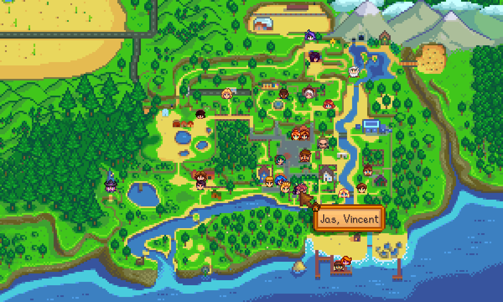

**NPC Map Locations** is a [Stardew Valley](http://stardewvalley.net/) mod which shows the
locations of NPC and farmers on the world map and on a minimap.

## Install
1. Install the latest version of [SMAPI](https://smapi.io).
2. Install [this mod from Nexus Mods](http://www.nexusmods.com/stardewvalley/mods/239).
3. Run the game using SMAPI.

## Use
### For players
Open the in-game map to see the positions for all NPCs, horses, players, and buildings. The map
supports custom locations and NPCs automatically.

While the map is open, press `TAB` (or `Y` on a controller) to show the mod options. You can
show/hide characters automatically based on various criteria (e.g. after they're talked to, when in
same location, within a certain distance, quests and/or birthdays, etc). 

You can optionally enable a minimap. You can move it by holding `CTRL` + right-click on the minimap,
then dragging it to the new position.

### For mod authors
See the [author guide](author-guide.md) for more info.

## Configure
### Global settings
The mod creates a `config/global.json` file in its mod folder the first time you run it, and a
separate file for each save. You can open those files in a text editor to configure the mod.

These are the available settings (most configurable through the in-game menu _except_ the key bindings):

setting            | what it affects
------------------ | ---------------
`NameTooltipMode`  | The tooltip position when pointing at something on the map. You can cycle this in-game using the `TooltipKey` option below. Default `1`.
`ImmersionOption`  | Which NPCs to display. The possible values are `All` (all villagers), `TalkedTo` (villagers you talked to today), and `NotTalkedTo` (villagers you didn't talked today). Default `All`.
`ByHeartLevel` `HeartLevelMin` `HeartLevelMax` | Whether to only show villagers whose hearts with the player is between `HeartLevelMin` and `HeartLevelMax`. Default `false`, `0`, and `12`.
`OnlySameLocation` | Whether to only show villagers in the same location as the player. Default `false`.
`MarkQuests`       | Whether to mark NPCs with quests or birthdays today. Default `true`.
`ShowChildren`          | Whether to show player children on the map. Default `false`.
`ShowFarmBuildings`     | Whether to show farm buildings on the map. Default `true`.
`ShowHiddenVillagers`   | Whether to show villagers that would normally be hidden. Default `false`.
`ShowHorse`             | Whether to show horses on the map. Default `false`.
`ShowTravelingMerchant` | Whether to show the Traveling Merchant when she's in the forest. Default `true`.
`NpcBlacklist`     | The list of NPCs that should be hidden. Default empty.
`ShowMinimap`      | Whether to show the floating minimap. Default `false`.
`MinimapX` `MinimapY` `MinimapWidth` `MinimapHeight` | The minimap's pixel position and size on screen, if it's enabled. Default `x=12`, `y=12`, `width=75`, `height=45`.
`MinimapExclusions`| Where the minimap should be disabled (not case-sensitive). Each value can be...<ul><li>an exact location name (as shown by [Debug Mode](https://www.nexusmods.com/stardewvalley/mods/679));</li><li>[`"Mines"`](https://stardewvalleywiki.com/The_Mines), [`"SkullCavern"`](https://stardewvalleywiki.com/Skull_Cavern), or [`"VolcanoDungeon"`](https://stardewvalleywiki.com/Volcano_Dungeon) for any level in those areas;</li><li>`"Indoors"` or `"Outdoors"`;</li><li>`"DeepWoods"` for any area in the [Deep Woods](https://www.nexusmods.com/stardewvalley/mods/2571) mod.</li></ul> Default empty.
`NpcExclusions`    | NPC names to hide from the map. default empty.
`NpcMarkerOffsets` | Custom offsets when drawing vanilla NPCs. You generally shouldn't change this.
`MenuKey`          | The [key binding](https://stardewvalleywiki.com/Modding:Player_Guide/Key_Bindings) to open the options menu when on the map view. Default `"Tab"`.
`TooltipKey`       | The [key binding](https://stardewvalleywiki.com/Modding:Player_Guide/Key_Bindings) to cycle the tooltip position when on the map view. Default `"Space"`.
`MinimapToggleKey` | The [key binding](https://stardewvalleywiki.com/Modding:Player_Guide/Key_Bindings) to toggle the floating minimap. Default `"OemPipe"` (i.e. the `|` button).

## FAQs
* **Why do I see duplicate villagers on the map with UI Info Suite?**  
  UI Info Suite has a feature to show villagers, so having it installed alongside this mod will
  show duplicate villagers. To continue using this mod, see the UI Info Suite options to disable
  its NPC tracking.

* **Does the map work with map recolors and custom maps?**  
  Yep. The mod doesn't change the world map itself, so it's compatible with all recolors and custom
  world maps.

* **Does the mod support custom locations/NPCs?**  
  Yep. For mod authors, see the [author guide](author-guide.md) for more info on how this works.

## Compatibility
Compatible with Stardew Valley 1.6+ on Linux/macOS/Windows, both single-player and multiplayer.

**In multiplayer, the mod will only work if the host player has it installed.**

## See also
* [Release notes](release-notes.md)
