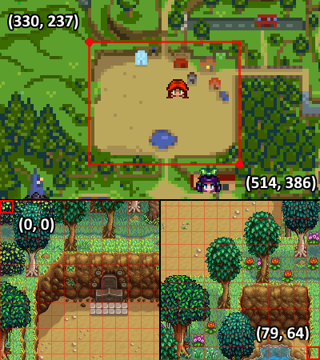
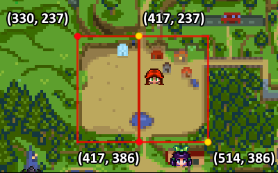
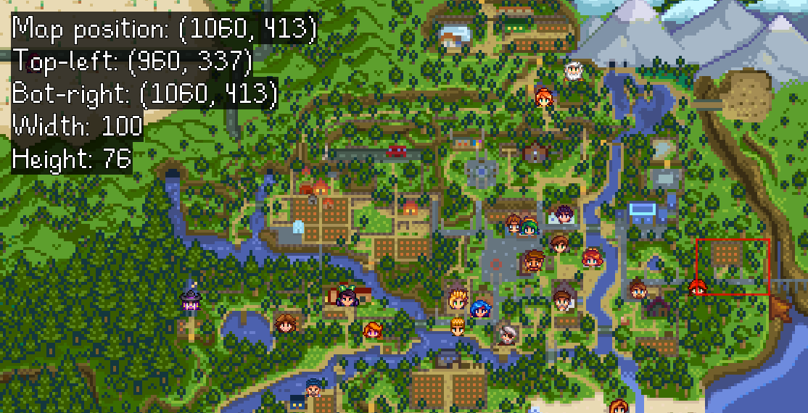
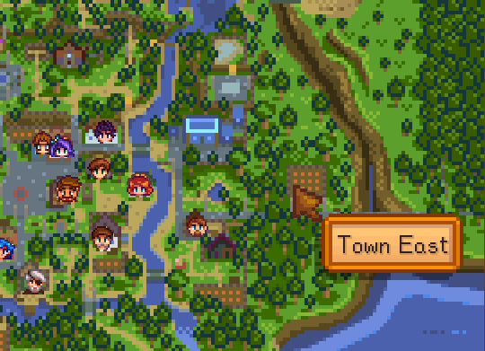

[← back to readme](README.md)

This document is for mod authors who'd like their mods to automatically configure NPC Map Locations
to support their custom locations or NPCs. **For players, see the [main readme](README.md) instead.**

# Contents
* [Basic concepts](#basic-concepts)
  * [Terminology](#terminology)
  * [Location tracking](#location-tracking)
  * [Position tracking](#position-tracking)
* [Customize a location](#customize-a-location)
  * [Create an accurate map](#create-an-accurate-map)
  * [Add map vectors](#add-map-vectors)
  * [Add map tooltips](#add-map-tooltips)
  * [Exclude location](#exclude-location)
* [Customize an NPC](#customize-an-npc)
  * [Set a custom crop offset](#set-a-custom-crop-offset)
  * [Exclude NPC](#exclude-npc)
* [Troubleshoot](#troubleshoot)
  * [Validate and test](#validate-and-test)
  * [Get more help](#get-more-help)

# Basic concepts
### Terminology
Mapping terms are often ambiguous. To avoid confusion, this document consistently uses these
definitions:

term               | definition
------------------ | ----------
world map          | The stylized map of the world shown in the game's map menu.
location           | An [in-game area](https://stardewvalleywiki.com/Modding:Modder_Guide/Game_Fundamentals#GameLocation_et_al), including every portion that can be reached without warping.
tile position      | A position within a location, measured in tiles (i.e. 64×64 pixel blocks which match the map sprite size).
map pixel position | A position within the world map, measured in pixels relative to the top-left corner of the map.
map vector         | See _position tracking_ below.

### Location tracking
The world map only shows outside locations, so NPC Map Locations scans all locations to build a
tree based on warps (and it remembers the warp tile positions). This automatically adjusts for
changes from other mods.

For example, the `Mountain` location looks something like this:
```
                                 ┌──────────┐
                                 │ Mountain │
                                 └────┬─────┘
          ┌─────────────────┬─────────┴─────────┬───────────────┐
┌─────────┴────────┐ ┌──────┴──────┐ ┌──────────┴─────────┐ ┌───┴───┐
│   Robin's house  │ │ Linus' tent │ │ Adventurer's guild │ │ Mines │
└─────────┬────────┘ └─────────────┘ └────────────────────┘ └───────┘
┌─────────┴────────┐
│ Sebastian's room │
└──────────────────┘
```

So if Sebastian is in his room, NPC Map Locations can determine that he's in the mountain location on
the world map, reachable from this specific outdoor tile:
> 

### Position tracking
In the example above, NPC Map Locations now knows which outdoor tile Sebastian is (indirectly) on.
However the world map is stylized; it's not drawn to scale and the map shape often doesn't closely
match the actual locations.

NPC Map Locations solves this with two parallel approaches:

1. It [redraws the world map](screenshot-2.0.0-redesign.gif) to more accurately reflect the in-game locations.
2. It adds known reference points called "map vectors". A map vector represents a single position
   with two coordinates: the in-game tile position, and the pixel position on the redrawn world
   map. Given these points, it can dynamically calculate the map pixel position for any in-game
   tile position (with [lerping](https://en.wikipedia.org/wiki/Linear_interpolation)).

In an ideal case where world map is drawn to scale, two map vectors at opposite diagonal corners
are all that's needed:
> 

If it's not to scale, more map vectors are needed to increase accuracy. For example, four map
vectors which split the location into local sections based on the landscape:
> 

# Customize a location
### Create an accurate map
Creating a custom world map is recommended if you're adding or modifying many areas on the map or
recoloring the map. Mod authors should edit the world map using the `Replace` patch mode, either
through [Content Patcher](https://stardewvalleywiki.com/Modding:Content_Patcher) or [SMAPI's
content API](https://stardewvalleywiki.com/Modding:Modder_Guide/APIs/Content):

```js
{
    "Action": "EditImage",
    "Target": "LooseSprites/map",
    "FromFile": "assets/{{season}}_map.png",
    "PatchMode": "Replace"
}
```

To draw a custom location accurately, the recommended method is...

1. [Take a screenshot](https://stardewvalleywiki.com/Options#Screenshots) of the full in-game
   location.
2. Open the NPC Map Locations map (e.g. from `NPCMapLocations\maps\_default\spring_map.png`) in a
   pixel editing app like [Paint.NET](https://www.getpaint.net/) or [GIMP](https://www.gimp.org/).
3. Open your full location screenshot. Scale it down until it's approximately the size it should be
   on the map.
4. Overlay the resized screenshot onto the map, and then redraw that portion of the map accordingly.
   You'll essentially be "tracing" the location onto the map to ensure accuracy.
5. Repeat steps 1-4 for any other custom locations.

[Here's a short video guide on the process](https://streamable.com/xzfnc). In this example I'm
creating a map for Grandpa's Grove farm by Jessebot. NOTE: This video guide is outdated, but the
method is still the same.

### Add map vectors
#### Standard tracking
If you add or customize an in-game **outdoor** location, you can define new [map
vectors](#basic-concepts) which lets NPC Map Locations correlate tile positions within the location
to pixels on the world map. There's no need to do this for indoor locations (see [location
tracking](#location-tracking)).

Here's the recommended process to define map vectors:

1. Enable `DebugMode` in NPC Map Location's `config\globals.json`.

   This will show extra info about the current location in-game, including the exact location name,
   its tile dimensions, and info about the selected box on the world map. It also lets you test the
   position mapping by `Ctrl` + right-clicking the map to warp to the equivalent tile position.
2. Load your save and go to the in-game location. (You can type `debug warp location-name` in the
   SMAPI console to go there quickly.)

   The top-left corner of the screen will show the location's name and tile size, and the tile
   position of the cursor:
   > 
3. Click the top-left corner of the location on the world map, drag to the bottom-right corner, and
   release. (You always need go from top-left to bottom-right.)

   In the top-left corner, this will show...
   * the pixel position of the cursor;
   * the pixel positions of the top-left and bottom-right corners of the selected area;
   * the pixel width and height of the selected area.

   > 
4. Now we can define the map vectors by editing the `Mods/Bouhm.NPCMapLocations/Locations` asset
   (that **exact** name) using [Content Patcher](https://stardewvalleywiki.com/Modding:Content_Patcher)
   or [SMAPI's content API](https://stardewvalleywiki.com/Modding:Modder_Guide/APIs/Content):

   ```js
   {
       "Action": "EditData",
       "Target": "Mods/Bouhm.NPCMapLocations/Locations",
       "Entries": {
           "TownEast": { // location name from step 2
               "MapVectors": [
                   { MapX: 960, MapY: 337, TileX: 0, TileY: 0 }, // top-left map pixel from step 3
                   { MapX: 1060, MapY: 413, TileX: 40, TileY: 30 } // bottom-right map pixel from step 3, and tile size from step 2
               ]
           }
       }
   }
   ```
5. Optionally add multiple map vectors to better track positions (particularly if the area on the
   world map isn't drawn to scale).

#### By farm type
To customize map vectors for the farm, you can use one of these as the location name:
* `Farm` (any farm type)
* `Farm_Default`
* `Farm_Riverland`
* `Farm_Forest`
* `Farm_Hills`
* `Farm_Wilderness`
* `Farm_FourCorners`
* `Farm_Beach`

#### Advanced: use a fixed map point
NPC Map Locations normally correlates in-game tile positions to the equivalent map pixel, so you
can see markers moving around within a location. That's recommended in most cases.

However you can show markers in a fixed position within the location. You do this by adding a
single map vector and omitting the tile coordinate:

```js
{   
    "Action": "EditData",
    "Target": "Mods/Bouhm.NPCMapLocations/Locations",
    "Entries": {
        "ExampleLocation": {
            "MapVectors": [
                { MapX: 36, MapY: 469 }
            ]
        }
    }
}
```

With the above example, characters in `ExampleLocation` will be shown at pixel (36, 469) on the
world map no matter where they are within the location.

### Add map tooltips
You can add tooltips when players point their cursor at the location in the world map, by adding a
`MapTooltip` field to the same `Mods/Bouhm.NPCMapLocations/Locations` entry you used to set the
[map vectors](#add-map-vectors). This includes the pixel area on the map which has the tooltip, and
the tooltip text to show.

For this we need the top-left corner and the width and height of the bounding box.

```js
{
    "Action": "EditData",
    "Target": "Mods/Bouhm.NPCMapLocations/Locations",
    "Entries": {
        "TownEast": {
            ...
            "MapTooltip": {
                "X": 960,
                "Y": 337,
                "Width": 100,
                "Height": 76,
                "PrimaryText": "Town East",
                "SecondaryText": null // optional second line under the primary text
            }
        }
    }
}
```

Here's how that would look in-game:
> 

### Exclude location
You can completely hide a location from NPC Map Locations. Any characters or players in that
location will vanish entirely from the world map. To do that, add an entry for the location name to
the `Mods/Bouhm.NPCMapLocations/Locations` asset (that exact name) using [Content
Patcher](https://stardewvalleywiki.com/Modding:Content_Patcher) or [SMAPI's content
API](https://stardewvalleywiki.com/Modding:Modder_Guide/APIs/Content):

```js
{
    "Action": "EditData",
    "Target": "Mods/Bouhm.NPCMapLocations/Locations",
    "Entries": {
        "Claire_WarpRoom": {
            "Exclude": true
        }
    }
}
```

**This isn't recommended for most cases, since having markers disappear can be confusing.** You
should only do this for locations which are outside the world map area.

## Customize an NPC
### Set a custom crop offset
NPC Map Locations automatically creates the marker icon for any NPC by cropping the head from its
sprite. However custom sprites might not always line up correctly:

> 

You can set a custom pixel offset to fix that. To do that, add an entry for the NPC name to the
`Mods/Bouhm.NPCMapLocations/NPCs` asset (that exact name) using [Content
Patcher](https://stardewvalleywiki.com/Modding:Content_Patcher) or [SMAPI's content
API](https://stardewvalleywiki.com/Modding:Modder_Guide/APIs/Content):

```js
{
    "Action": "EditData",
    "Target": "Mods/Bouhm.NPCMapLocations/NPCs",
    "Entries": {
        "Alex": {
            "MarkerCropOffset": -2
        },
        ...
    }
}
```

And then you can check the map options to see the corrected result:

> 

### Exclude NPC
You can completely hide an NPC from NPC Map Locations. They will vanish entirely from the world map.
To do that, add an entry for the location name to the `Mods/Bouhm.NPCMapLocations/NPCs` asset (that
exact name) using [Content Patcher](https://stardewvalleywiki.com/Modding:Content_Patcher) or
[SMAPI's content API](https://stardewvalleywiki.com/Modding:Modder_Guide/APIs/Content):

```js
{
    "Action": "EditData",
    "Target": "Mods/Bouhm.NPCMapLocations/NPCs",
    "Entries": {
        "Claire_Joja": {
            "Exclude": true
        }
    }
}
```

**This isn't recommended for most cases, since having NPCs disappear can be confusing.** You
should only do this for NPCs which players wouldn't normally go looking for.

## Troubleshoot
### Validate and test
If your JSON isn't valid, SMAPI will throw an error and the game may crash. You can use the [JSON
validator](https://json.smapi.io/) to make sure it's valid ahead of time. If it's valid, you can
load the save and check the locations and NPCs on the world map.

### Get more help
Visit the [Stardew Valley Discord](https://discord.gg/stardewvalley) in the `#making-mods` channel
if you have any questions!
