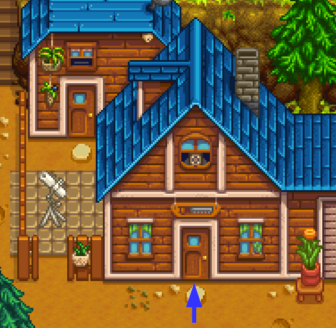
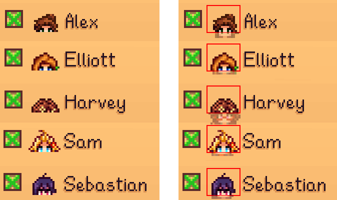
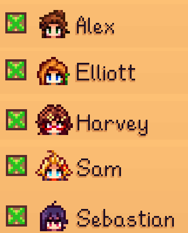
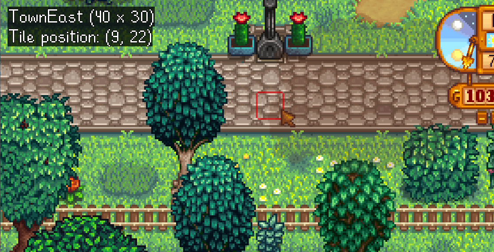

[← back to readme](README.md)

This document is for mod authors who'd like their mods to automatically configure NPC Map Locations
to support their custom locations or NPCs. **For players, see the [main readme](README.md) instead.**

## Contents
* [Location and position tracking](#location-and-position-tracking)
  * [Overview](#overview)
  * [Add a custom location](#add-a-custom-location)
  * [Hide a custom location](#hide-a-custom-location)
  * [Customize an NPC icon](#customize-an-npc-icon)
  * [Hide an NPC](#hide-an-npc)
* [Tools for mod authors](#tools-for-mod-authors)
  * [Debug mode](#debug-mode)
* [FAQs](#faqs)
  * [Didn't NPC Map Locations previously redraw the world map?](didnt-npc-map-locations-previously-redraw-the-world-map)
  * [Where can I get more help?](#where-can-i-get-more-help)

## Location and position tracking
### Overview
The mod uses the [position data in `Data/WorldMap`](https://stardewvalleywiki.com/Modding:World_map)
when possible. For example, the base game has info about Sebastian's room in `Data/WorldMap`; so
when Sebastian is in his room, NPC Map Locations can place his marker on the world map at the
matching position automatically.

If a location isn't in `Data/WorldMap` (e.g. a custom location which the author forgot to add world
map data for), NPC Map Locations builds a hierarchical tree of the in-game locations based on the
warps between them. This automatically reflects changes from other mods.

For example, the `Mountain` location looks something like this:
```
                                 ┌──────────┐
                                 │ Mountain │
                                 └────┬─────┘
          ┌─────────────────┬─────────┴─────────┬───────────────┐
┌─────────┴────────┐ ┌──────┴──────┐ ┌──────────┴─────────┐ ┌───┴───┐
│   Robin's house  │ │ Linus' tent │ │ Adventurer's guild │ │ Mines │
└─────────┬────────┘ └─────────────┘ └────────────────────┘ └───────┘
┌─────────┴────────┐
│ Sebastian's room │
└──────────────────┘
```

So if only the `Mountain` location was in `Data/WorldMap`, NPC Map Locations can determine that
Sebastian in his room can be reached from this specific tile on the mountain, and would show him at
the world map position matching that tile:

> 

### Add a custom location
You don't need to tell NPC Map Locations about your custom location directly. Instead, there are
two main approaches:

* [Add your custom location to the game's `Data/WorldMap` asset](https://stardewvalleywiki.com/Modding:World_map),
  and NPC Map Locations will use that data automatically.
* If your location isn't in `Data/WorldMaps`, NPC Map Locations will detect warps that lead to your
  location from a location that is in `Data/WorldMaps`. See the previous question for more info.

### Hide a custom location
You can completely hide a location from NPC Map Locations, as long as it's not in `Data/WorldMap`.
Any characters or players in that location will vanish entirely from the world map.

**This isn't recommended in most cases, since having markers disappear can be confusing.** You
should only do this for special cases like NPC warp rooms.

To hide a location, add an entry for the location name to the `Mods/Bouhm.NPCMapLocations/Locations`
asset (that exact name) using [Content Patcher](https://stardewvalleywiki.com/Modding:Content_Patcher)
or [SMAPI's content API](https://stardewvalleywiki.com/Modding:Modder_Guide/APIs/Content):

```js
{
    "Action": "EditData",
    "Target": "Mods/Bouhm.NPCMapLocations/Locations",
    "Entries": {
        "Claire_WarpRoom": {
            "Exclude": true
        }
    }
}
```

## Customize an NPC icon
NPC Map Locations automatically creates the marker icon for any NPC by cropping the head from its
sprite. However custom sprites might not always line up correctly:

> 

You can set a custom pixel offset to fix that. To do that, add an entry for the NPC name to the
`Mods/Bouhm.NPCMapLocations/NPCs` asset (that exact name) using [Content
Patcher](https://stardewvalleywiki.com/Modding:Content_Patcher) or [SMAPI's content
API](https://stardewvalleywiki.com/Modding:Modder_Guide/APIs/Content):

```js
{
    "Action": "EditData",
    "Target": "Mods/Bouhm.NPCMapLocations/NPCs",
    "Entries": {
        "Alex": {
            "MarkerCropOffset": -2
        },
        ...
    }
}
```

And then you can check the map options to see the corrected result:

> 

### Hide an NPC
You can completely hide an NPC from NPC Map Locations. They will vanish entirely from the world map.

**This isn't recommended for most cases, since having NPCs disappear can be confusing.** You should
only do this for NPCs which players wouldn't normally go looking for.

To hide an NPC, add an entry for their name to the `Mods/Bouhm.NPCMapLocations/NPCs` asset (that
exact name) using [Content Patcher](https://stardewvalleywiki.com/Modding:Content_Patcher) or
[SMAPI's content API](https://stardewvalleywiki.com/Modding:Modder_Guide/APIs/Content):

```js
{
    "Action": "EditData",
    "Target": "Mods/Bouhm.NPCMapLocations/NPCs",
    "Entries": {
        "Claire_Joja": {
            "Exclude": true
        }
    }
}
```

## Tools for mod authors
### Debug mode
You can optionally enable `DebugMode` in NPC Map Location's `config\globals.json` file. This will
show some info in the top-left corner:
* the current location name and its tile size;
* the tile position under your cursor.

> 

This also lets you `Ctrl` + right-click on the world map to warp to the equivalent tile position.

## FAQs
### Didn't NPC Map Locations previously redraw the world map?
Yep, it previously [replaced the world map with a more accurate version](screenshot-2.0.0-redesign.gif).
That let it show accurate real-time positions on the world map, by mapping coordinates between the
in-game location and world map.

Stardew Valley 1.6 added `Data/WorldMap`, which lets mods replace and extend the world map,
including support for positioning data. This is less accurate than the redrawn map for vanilla
locations, but mods can easily extend it with their own custom locations.

NPC Map Locations 3.0.0 removed the redrawn world map to avoid conflicting with that new feature.

### Where can I get more help?
Visit [#making-mods in the Stardew Valley Discord](https://stardewvalleywiki.com/Modding:Community#Discord),
we'll be happy to answer your questions! You can ping the maintainer directly with `@pathoschild`.
