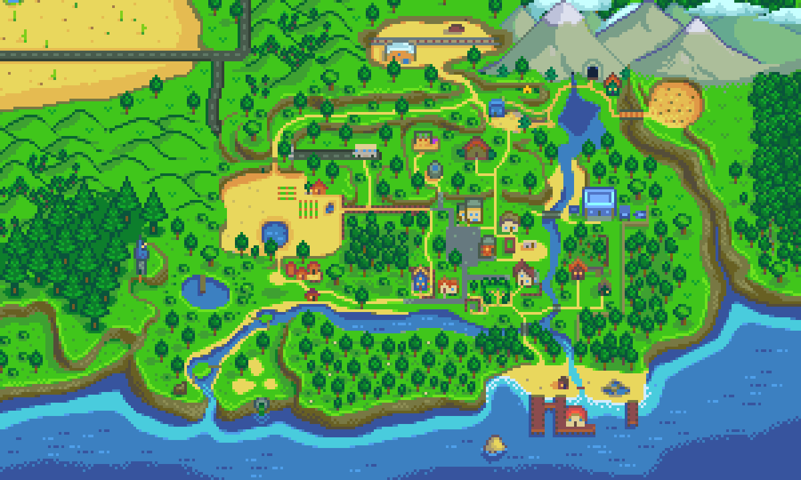

[← back to readme](README.md)

# Release notes
## Upcoming release
* Improved translations. Thanks to ChulkyBow (added Ukrainian)!

## 2.7.2
Released 27 December 2021 for SMAPI 3.13.0. Updated by Pathoschild.

* Updated for Stardew Valley 1.5.5, including custom farm type support.
* Fixed upgraded sheds having no map icon.
* Fixed missing section label in settings (thanks to Zangorr!).
* Improved translations. Thanks to ellipszist (added Thai) and Zangorr (updated Polish)!

## 2.7.1
Released 26 November 2021 for SMAPI 3.12.5. Updated by Pathoschild.

* Improved the `npc_map_locations_summary` command:
  * Added a table of location data.
  * The map vectors list now includes those bundled with NPC Map Locations.
* Fixed farm buildings not shown on load if any location without map vectors is also excluded.
* Fixed Caldera not handled as part of the Volcano Dungeon.
* Improved translations. Thanks to Zangorr (added Polish)!

## 2.7.0
Released 20 October 2021 for SMAPI 3.12.5. Updated by Pathoschild.

* Added `npc_map_locations_summary` console command, which shows a summary of the current state for troubleshooting.
* Improved [mod author guide](author-guide.md).
* Improved support for the Volcano Dungeon.
* Fixed traveling cart marker never shown.
* Fixed error if a map sync happens mid-warp in multiplayer.
* Fixed error when a location has invalid data.
* Fixed various edge cases.

## 2.6.6
Released 24 August 2021 for SMAPI 3.12.2. Updated by Pathoschild.

* Fixed mod not working correctly if a location couldn't be loaded.
* Fixed error loading map info for the Volcano Dungeon. That area is now ignored.

## 2.6.5
Released 20 August 2021 for SMAPI 3.12.2. Updated by Pathoschild.

* Fixed possible errors when scanning locations.
* Improved translations. Thanks to Aulberon (updated Portuguese) and Evelyon (updated Spanish)!

## 2.6.4
Released 06 August 2021 for SMAPI 3.12.2. Updated by Pathoschild.

* Fixed crash when scanning locations in some cases.
* Fixed NPC markers not working when the multiplayer host is non-English.
* Fixed NPC marker offsets in `config/global.json` always overwritten by default values for vanilla NPCs.
* Fixed error when a mod overrides the vectors for a known location via `Mods/Bouhm.NPCMapLocations/Locations`.
* Fixed NPCs hidden in the map options no longer unhideable after starting a new day.
* Improved translations. Thanks to martin66789 (added Hungarian)!

## 2.6.3
Released 17 July 2021 for SMAPI 3.11.0. Updated by Pathoschild.

* Fixed crash when a location has circular warps in some cases.
* Fixed error when a location has invalid warp targets.
* Fixed map positioning on the beach farm (thanks to RushedLogic!).
* Fixed misaligned minimap texture on the beach farm (thanks to RushedLogic!).
* Fixed villager names not translated in map tooltips.
* Internal refactoring and optimizations.

## 2.6.2
Released 28 February 2021 for Stardew Valley 1.5 and SMAPI 3.9.

* Updated for the new Stardew Valley 1.5 content.
* Fixed most bugs related to multiplayer and the new game update (thanks to boleanly for most of these!).
* Removed bundled compatibility patches for custom maps and NPCs.
* Fixed multiplayer crashes.
* Fixed island minimap cropping.

**Update note for players and mod authors:**  
Custom maps are no longer bundled with NPC Map Locations. Instead mod authors should [patch the NPC
Map Locations data from their mod](author-guide.md).

## 2.6.0
Released 22 February 2021 for Stardew Valley 1.5 and SMAPI 3.9.

## 2.5.12
Released 22 December 2020 for Stardew Valley 1.5 and SMAPI 3.8.

* Partially updated for Stardew Valley 1.5.

## 2.5.11
Released 15 August 2020 for Stardew Valley 1.4 and SMAPI 3.5.

* Added compatibility with custom quest mods (thanks to Esca!).
* Fixed map only updating when host opens map in multiplayer.
* Fixed other multiplayer sync inconsistencies.
* Fixed bug where the inventory and other menus got replaced with the map.
* Fixed handling for custom NPCs in different localizations of the game.
* Added a `LocationBlacklist` field in `customlocations.json` to hide NPCs in specific locations.  
  _Useful for when you have a secret warp room that no one should know about. Looking at you, Claire from SVE._

## 2.5.9
Released 31 May 2020.

* Added option to show player children.
* Added tracking for new custom locations in Stardew Valley Expanded.
* Added Stardew Foliage Redone maps for Stardew Valley Expanded (thanks to HESPERONIS!).
* Added custom field to let mod authors hide a custom NPC from the map.
* Fixed custom NPCs not properly synced in multiplayer.
* Fixed custom NPCs not displayed properly in mod menu.
* Fixed main player settings affecting NPC syncing for other players.
* Fixed horse not properly tracked.
* Fixed NPCs stuck in starting location or top-left corner and never moving.
* Fixed minimap movement (now just right-click and drag).
* Fixed minimap toggle not persisting correctly.
* Fixed movie theater and trailer house upgrade in wrong place.
* Fixed movie theater and Wizard basement unknown.

## 2.5.5
Released 19 March 2020 for Stardew Valley 1.4 and SMAPI 3.0.

* Updated for Stardew Valley 1.4 content (including the Four Corners farm map, movie theater, and other new content shown on the map).
* Now shows more NPCs by default (including Dwarf, Krobus, Gunther, and horse). They'll appear once you've unlocked them in your save.
* Added option to disable the horse.
* The `NpcBlacklist` field to hide NPCs is now a global config.
* The farmhouse is now shown dynamically for compatibility with mods that move it.
* The minimap readjustment is now smarter when entering a location smaller than the viewport.
* Fixed SVE character markers not properly cropped.
* Fixed location tooltips not padded to match the game tooltips.
* Fixed sewer pipe and spa tooltips.
* Fixed married NPCs not showing up on the map.
* Fixed duplicate Marlons when used with Stardew Valley Expanded.
* Fixed accessing map tab in Android.
* Fixed occasional JSON serialization errors.

## 2.5.2
Released 27 November 2019 for Stardew Valley 1.4 and SMAPI 3.0.

* Updated for Stardew Valley 1.4 and SMAPI 3.0.

## 2.5.1
Released 19 September 2019.

## 2.5.0
Released 19 September 2019.

This update focuses on making NPC Map Locations as future-proof and extensible as possible with
compatibility with other mods.

* All indoor locations are now located automatically (even custom locations), as long as there's tracking for its outdoor location and there's a valid warp into it. As a result, you may notice that characters are not perfectly centered within indoor locations on the map as they were before when they were located manually. This is still a much better solution in the long run.
* The default key binding for dragging the minimap is now `CTRL` instead of `ALT` to reduce keybind conflicts.
* Split global settings into `config/global.json`.
* Compatibility patches are now separate. You can download them from Optional Files on the mod page and unpack them into the mod's `maps` folder. Each folder in `maps` now has all the files needed for compatibility with that mod (including special config for Stardew Valley Expanded). For mod authors, see [mod author documentation](author-guide.md).
* Removed `CustomMapTextures`; use Content Patcher to patch the map asset instead.
* Fixed game crashes from "content file not found" errors.
* Fixed custom location handling for different farm types.

## 2.4.2
Released 22 July 2019.

* Added dynamic recolor map loading (thanks to Pathoschild!).
* Changed to one-step install for use with Stardew Valley Expanded because the previous method was creating confusion.
* Fixed custom farm types crashing the game.

## 2.4.1
Released 09 July 2019.

* Fixed multiplayer bugs.
* Fixed issue where map tried to load before the config.

## 2.4.0
Released 30 June 2019.

* Added full compatibility with Stardew Valley Expanded.
* Improved handling of conflicts with Content Patcher loading maps.
* Fixed issues with loading recolored maps.
* Fixed issue with Free Dusty crashing the options menu.

## 2.3.3
Released 30 March 2019.

* Added support for more recolor mods.
* Recolored maps are no longer included by default. Download them separately from the optional files if needed.
* Fixed several bugs with loading recolored and/or seasonal maps.

## 2.3.2
Released 16 February 2019.

* Added seasonal maps that load automatically with season change. (Thanks to Elle aka Junimods for providing seasonal maps for Elle's Dirt and Cliff Recolor!)
* Added compatibility with Elle's Dirt and Cliff Recolor.
* Added bundled recolors for Eemie's Map Recolour, Starblue Valley, A Toned Down SDV, and Elle's Recolor.
* Added option to specify user-provided map recolors.
* Added option to blacklisting locations that should disable the minimap.

## 2.3.1
Released 19 January 2019 for SMAPI 2.9.

* Added warning when playing multiplayer and the host doesn't have the mod installed.
- Added a feature to automatically adjust map tracking for modded maps. For example, for modded farms that are larger than vanilla, the tracking will be more accurate to be scaled to the size of the modded farm.
* Fixed bug with custom NPCs where custom names and marker crops weren't working correctly.
* Fixes bug with MTN2.
* Fixed bug where quest/birthday setting wasn't properly toggling.

## 2.3.0
Released 16 December 2018 for SMAPI 2.9.

* Prepared for SMAPI 3.0.
* Added a `default.json` config file you can edit to set the default options for new saves.
* The minimap is now disabled by default.
* Fixed crash when using certain NPC dialogue mods.
* Fixed map trying to load before required config.
* Fixed multiplayer farmhands not seeing villagers move.

## 2.2.2
Released 19 November 2018 for Stardew Valley 1.3.32 and SMAPI 2.8.

* Now works for all players who have it installed in multiplayer.
* Config files are now per-save, located in the `config` folder.
* Improved support for custom locations.
* Changed hotkey for minimap from `TAB` to `|`.
* Fixed "Farmer marker null exception" bug in multiplayer that prevented the mod from working.
* Fixed minimap sometimes disappearing despite being enabled.

## 2.2.1
Released 19 October 2018 for Stardew Valley 1.3.28 and SMAPI 2.7.

* Added support for custom locations.
* Added partial multiplayer support.
* Improved the minimap.
* Fixed bugs.

## 2.2.0?
Released 03 October 2018 for Stardew Valley 1.3.31.

* Added a new configurable minimap HUD.
* Added support for custom maps/locations.
* Added map details to Desert.
* Tweaked additional building colors for map recolors.
* Improved detecting whether a character is in the same location.
* Fixed issues with location name changes with game update (mines, night market).
* Fixed issue with custom NPC mods.
* Fixed issue with new/unknown locations.
* Fixed placement of Pam/Penny's new house.

## 2.1.5
Released 17 June 2018.

* The mod now replaces the game's `MapPage` with its own subclass instead of just drawing over it, which enables some of the fixes below.
* Recolored maps are now always included in files, so no separate optional downloads needed.
* Updated maps to include Pam's house upgrade.
* Fixed layering issues with tooltips.
* Fixed cursor not snaping to the correct locations when using a controller.
* Fixed birthday/quest icons not disappearing after gifting.
* Fixed traveling merchant shown every day.
* Fixed lonely stone not making a sound when clicked.

## 2.1.4
Released 19 May 2018(?) for Stardew Valley 1.3.11.

* Fixed issue with NPCs not properly updating due to an optimization change.

## 2.1.3
Released 19 May 2018(?) for Stardew Valley 1.3.11.

* Updated for Stardew Valley 1.3.11.
* Added many optimizations to address severe frame drop issues.
* Removed snappy controller hack for controller users.

## 2.0.3
Released 19 May 2018 for Stardew Valley 1.2 and SMAPI 2.5+.

* Shows NPC locations on the map using an accurately modified map page.
* Fixed game crash for controller users.
* Removed snappy controller hack.

## 2.1.2
Released 08 May 2018(?) for SMAPI 2.6-beta.8+.

* Fixed issue with duplicate farmhand markers showing up every new day.
* Fixed issue with farm buildings not repositioning properly with zoom changes.
* Fixed issue when using the mod with a controller.
* Changed to only show map load info message when a recolored map is used.

## 2.1.1
Released 08 May 2018 for SMAPI 2.6-beta.8+.

* Updated for new Stardew Valley 1.3 content.
* Added cabin markers.
* Added recolored maps under Optional Files for users who have Starblue Valley or Eemie's Map Recolour installed (thanks to Ria / riazaia!).
* Multiplayer farmhands can now see each other on the map.
* Optimized slightly.
* Tweaked map a bit.
* Fixed bugs.

## 2.1.0-beta
Released 30 April 2018(?) for Stardew Valley 1.3-beta.

* Fixed compatibility with Stardew Valley 1.3-beta.

## 2.0.2
Released 30 April 2018 for Stardew Valley 1.2.

* Fixed most "null key" errors.
* Renamed `content` folder to `assets` to avoid conflict with game folder names.

## 2.0.1
Released 06 April 2018.

* Fixed handling for unknown locations by skipping that marker.
* Internal refactoring and optimization.
* Fixed Marlon/Wizard shown in options menu before the player unlocks them.
* Tweaked map (bigger docks, fixed stray pixel).
* Disabled controller snappy mode while map is open.

## 2.0.0
Released 31 March 2018.

* Added a completely reworked tracking system that's accurate for the whole map (more helpful for other mod developers).
* Added a heavily modified map page that's much more accurate to the game world (this took forever).
* Added player tracking (the main reason for the above changes).
* Added farm buildings to the map.
* Added a tiny house icon on the top-left of the name tooltip if the hovered NPC is indoors.
* Added controller support.
* Added translations for localization.
* Moved tooltip out of menu, and added `Space` or D-Pad hotkey to cycle positions (because menu space is precious).
* Updated for new game content (new locations, new farms).
* Fixed tooltip overlay issues.



## 1.4.6
Released 04 March 2017 for SMAPI 1.6.

* Updated for SMAPI 1.6.
* Fixed _ArgumentException: An item with the same key has already been added_ error with custom NPCs.
* Fixed _KeyNotFoundException_ error for hovered NPCs.
* Fixed show Wizard/Sandy/Marlon options.

SDV Localization Beta (For SMAPI 1.9-Beta):
* Fixed _MissingFieldException_ error.
* Fixed crash in Stardew Valley beta. However the mod is not fully compatible yet (no name/location tooltips, improper layering of NPC sprites on map, localization still a work in progress).

## 1.4.5
Released 10 January 2017.

* Adopted semantic versioning.
* Migrated to SMAPI's new update-check feature.
* Fixed hardware cursor issue.

## 1.44
Released 04 December 2016.

* Pressing "OK" or `TAB` on the mod menu open now returns to the map instead of closing the whole menu.
* Villagers with custom names now have their custom names reflected on the map including in the menu, the name tooltip, and the location tooltip. Custom sprite crops can be adjusted in `config.json`.
* SMAPI 1.3 supports crossplatform compatibility, so the separate Linux/macOS versions of the mod have been removed.
* Fixed `KeyNotFoundException` (I hope).

## 1.43
Released 20 November 2016.

* Fixed _FormatException: Input string was not in a correct format_ error.
* Fixed mod menu not working on Linux/macOS.
* Fixed typos.

## 1.42
Released 18 November 2016 for SMAPI 1.1.

* Updated for SMAPI 1.1.
* Added crossplatform compatibility for Linux/macOS.
* Added version checker that notifies you when an update for the mod is available.
* Added option to show hidden NPCs instead of completely hiding them.
* Added NPC markers next to names in mod menu.

## 1.4
Released 13 October 2016.

* **New feature:**
  * Added feature to mark NPC with active daily quests (from the Bulletin Board) or on their birthdays.

    NPCs with active quests will have a `!` icon and NPCs with birthdays will have a Gift Box icon on the top-right corner of their map markers. Quest marks will disappear after the quest completes/expires and birthday marks will disappear when the NPC is gifted or the birthday ends.

    Marked NPCs will also always be at the top if they're in the same location as other NPCs.
* **Menu changes:**
  * Added new options (the new feature, an option to show the traveling merchant, and option to show any custom NPCs).
  * Added include/exclude NPC options for Sandy, Marlon, and Wizard (once unlocked).  
    _These options are mainly for any mods that add schedules to these NPCs (ex. marriage mod). Wizard is shown by default since he is a quest giver._
* **Minor changes/fixes:**
  * The name tooltip now stacks names in new lines instead of being one long string when there are a lot of NPCs in a location.
  * Tweaked the map.
  * Fixed issues in mod menu where clicks weren't being recieved properly for checkboxes/slider.
* **Custom NPC compatibility:**
  * Custom NPCs _with their own schedule files_ will now show up on the map and on the mod menu. Note that installing custom NPCs requires modification of save files, so they will only show up for save files that have been modified to include the custom NPCs. Even if the mod supports up to 5 custom NPCs, you can probably only reliably use one at a time due to the fact that they modify the same files, unless you can merge them correctly.

    Once the mod detects that a custom NPC has been properly installed, the custom NPC will automatically be included in the `config.json` file under `customNPCs: { }`. For example, for Florence it will look like:

    ```js
    "customNPCs": {
        "Florence": {
            "id": 1,
            "crop": 0,
            "Bouhm_135372711": 1
        }
    }
    ```

   You can change how the custom NPC's head is cropped to show up on the map by changing the number for `"crop": 0`. Setting it to `3` will move the NPC sprite 3 pixels, setting it to `-3` will move the NPC sprite down by 3 pixels. It is set to `0` by default and will probably only need to be tweaked for custom NPC sprites that are particularly tall or short.
