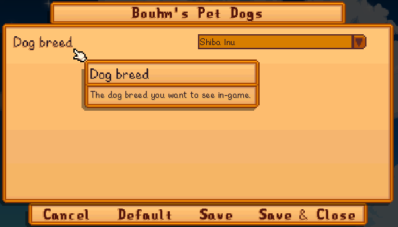

**Bouhm's Pet Dogs** is a [Stardew Valley](http://stardewvalley.net/) content packs which replaces
the in-game dog with a Shiba Inu, German Shepherd, or Husky.

## Install
1. Install the latest version of [SMAPI](https://smapi.io) and [Content Patcher](https://www.nexusmods.com/stardewvalley/mods/1915).
2. Install [this mod from Nexus Mods](http://www.nexusmods.com/stardewvalley/mods/570).
3. Run the game using SMAPI.

## Configure
### In-game settings
If you have [Generic Mod Config Menu](https://www.nexusmods.com/stardewvalley/mods/5098) installed,
you can click the cog button (⚙) on the title screen to configure the mod. Hover the cursor over
a field for details, or see the next section.

### `config.json` file
The mod creates a `config.json` file in its mod folder the first time you run it. You can open that
file in a text editor to configure the mod.

Here's what you can change:

setting  | default    | what it affects
:------- | :--------- | :------------------
`Breed1` `Breed2` `Breed3` | `shibainu` `shepherd` `husky` | The dog breed to use for each of the three breed slots. The possible values are `husky`, `shepherd`, `shibainu`, or `none` (to leave the base-game breed unchanged).

## Compatibility
Compatible with Stardew Valley 1.4 and 1.5+ on Linux/macOS/Windows, both single-player and
multiplayer.

## See also
* [Release notes](release-notes.md)
