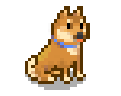

**Bouhm's Pet Dogs** is a [Stardew Valley](http://stardewvalley.net/) content packs which replaces
the in-game dog with a Shiba Inu, German Shepherd, or Husky.

## Install
1. Install the latest version of [SMAPI](https://smapi.io) and [Content Patcher](https://www.nexusmods.com/stardewvalley/mods/1915).
2. Install [this mod from Nexus Mods](http://www.nexusmods.com/stardewvalley/mods/570).
3. Run the game using SMAPI.

## Compatibility
Compatible with Stardew Valley 1.4 and 1.5+ on Linux/macOS/Windows, both single-player and
multiplayer.

## See also
* [Release notes](release-notes.md)
